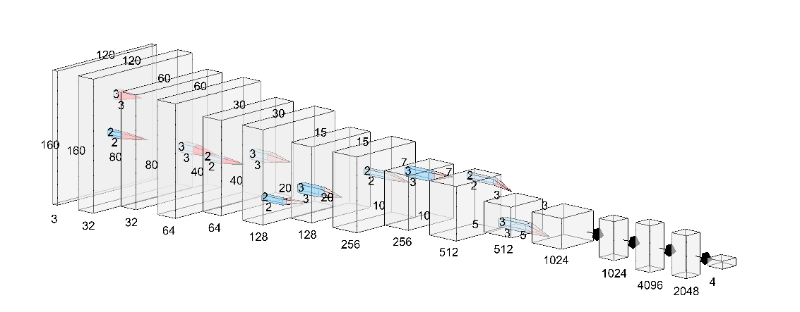

# Object-Localization

A model for localizing objects in images, build from scratch using keras and trained on dataset for Object Localization provided by Flipkart for GRiD – Te[a]ch The Machines (2019) - ML Challenge.

The model achieved an Intersection-over-Union (IoU) value of 0.86 over test set (i.e. my final score for the competition).

<h2>Model Architecture</h2>
<kbd></kbd>

